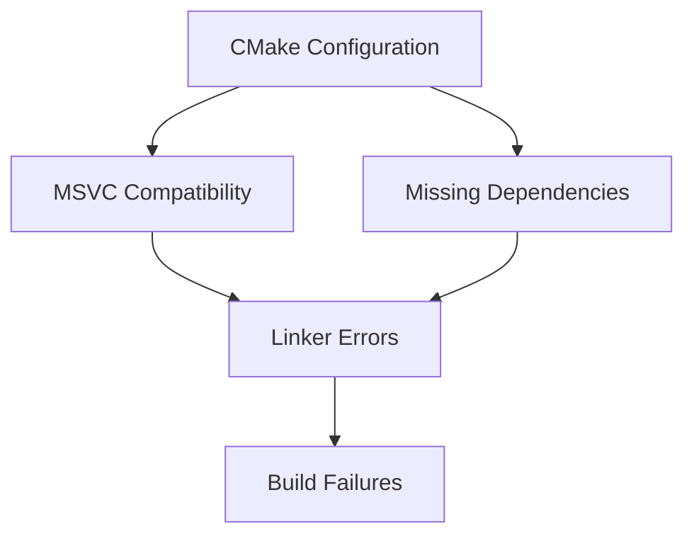
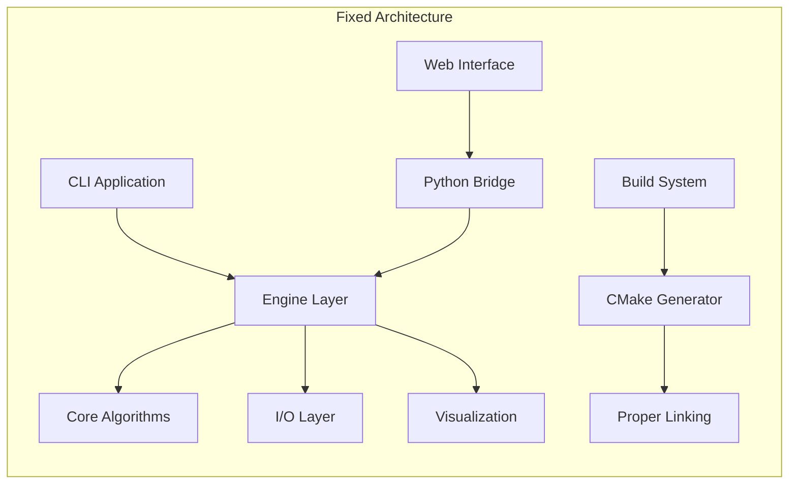
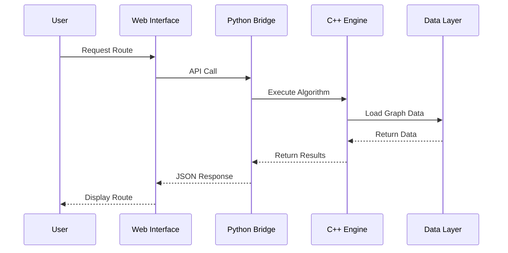
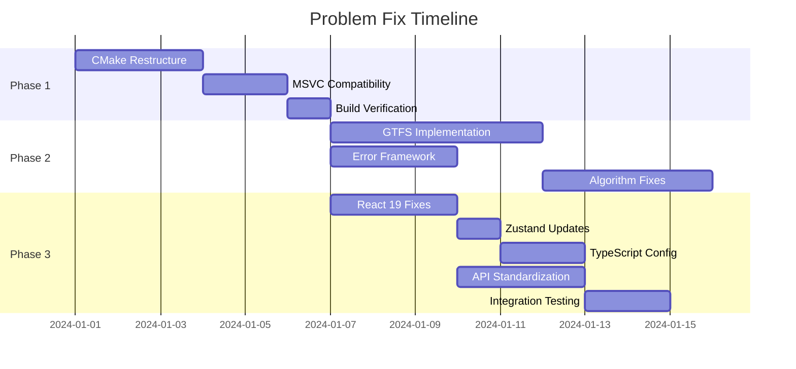

# RouteTransitSimulator Problem Fixes Design

## Problem Summary Update

**Total Problems Identified**: 304 (increased from 253)

**New Issues Discovered**:
- 51 TypeScript compilation errors in test files
- Component import/export mismatches
- Outdated store references in tests
- Missing type definitions for React DOM
- Vite configuration conflicts

## Overview

This design document outlines a systematic approach to identify, categorize, and fix the 253 problems in the RouteTransitSimulator project. The problems span across compilation issues, missing implementations, configuration problems, architectural inconsistencies, and new React 19 compatibility issues.

## Problem Categories

### 1. Build System Issues (Category A - High Priority)

#### A1. CMake Configuration Problems
- **Missing directories**: The main CMakeLists.txt references `docs` subdirectory which exists but has placeholder content
- **Interface libraries**: Several modules (io, engine, viz) are defined as INTERFACE libraries with placeholder comments
- **Dependency chain**: Complex linking dependencies between modules may cause circular references

#### A2. Compilation Errors
- **MSVC vs GCC compatibility**: The compile.bat uses MSVC while CMake expects GCC/MinGW
- **Missing include paths**: Some headers may not be properly included in the compilation chain
- **C++20 feature usage**: Not all compilers may support the C++20 features being used



### 2. Implementation Gaps (Category B - High Priority)

#### B1. Placeholder Implementations
- **Engine module**: Contains only placeholder CMakeLists.txt with commented subdirectories
- **I/O module**: Missing actual GTFS parser implementations
- **Visualization**: Header-only implementations may lack critical functionality

#### B2. Missing Core Features
- **GTFS validation**: No proper dataset validation before processing
- **Error handling**: Insufficient exception handling in core algorithms
- **Memory management**: Potential memory leaks in graph operations

### 3. Frontend Integration Issues (Category C - High Priority)

#### C1. React/TypeScript Configuration
- **TypeScript compatibility**: React 19 compatibility issues with Zustand
- **Build configuration**: Missing or incorrect Vite configuration
- **Port conflicts**: Web server running on port 8080 instead of expected ports

#### C2. API Integration
- **Backend connectivity**: Python web server may not properly interface with C++ backend
- **Error handling**: Frontend lacks proper error handling for backend failures
- **Real-time communication**: SSE and WebSocket implementations may be incomplete

### 4. React 19 Compatibility Issues (Category D - High Priority)

#### D1. Zustand Integration Problems
- **Version compatibility**: Zustand 5.0.8 required for React 19.1.1 compatibility
- **Store creation syntax**: Incorrect double parentheses usage in store creation
- **useSyncExternalStore changes**: React 19 changes affecting Zustand functionality

#### D2. Component Import/Export Issues
- **Unused React imports**: Multiple components have unused 'import React from 'react''
- **Component reference errors**: Missing or incorrect component exports
- **TypeScript strict mode**: New strict linting rules causing compilation failures

### 5. TypeScript Configuration Issues (Category E - Medium Priority)

#### E1. Build Configuration Problems
- **Vite configuration**: Path aliases not properly resolved
- **TypeScript project references**: Circular dependencies in tsconfig files
- **ESLint integration**: New React ESLint rules causing linting failures

#### E2. Type Definition Issues
- **API type mismatches**: Interface definitions not matching implementation
- **Missing type exports**: Some types not properly exported from modules
- **Strict mode violations**: noUnusedLocals and noUnusedParameters causing failures

## Architecture Fixes

### Core System Architecture



### Data Flow Improvements



## Detailed Fix Strategy

### Phase 1: Build System Stabilization

#### 1.1 CMake Restructuring
```cmake
# Proposed CMakeLists.txt structure
cmake_minimum_required(VERSION 3.20)
project(RouteTransitSimulator VERSION 1.0.0 LANGUAGES CXX)

# Compiler detection and configuration
if(MSVC)
    set(CMAKE_CXX_FLAGS "${CMAKE_CXX_FLAGS} /std:c++20 /EHsc")
else()
    set(CMAKE_CXX_FLAGS "${CMAKE_CXX_FLAGS} -std=c++20 -Wall -Wextra")
endif()

# Dependency resolution
find_package(Threads REQUIRED)

# Module organization with proper dependencies
add_subdirectory(core)      # Core first - no dependencies
add_subdirectory(io)        # I/O depends on core
add_subdirectory(engine)    # Engine depends on core + io
add_subdirectory(viz)       # Viz depends on core
add_subdirectory(bench)     # Bench depends on core
add_subdirectory(cli)       # CLI depends on all above
add_subdirectory(tests)     # Tests depend on all modules
```

#### 1.2 Compiler Compatibility Matrix
| Compiler | Version | C++20 Support | Status |
|----------|---------|---------------|--------|
| MSVC | 19.30+ | Full | ✅ Primary |
| GCC | 10+ | Full | ✅ Secondary |
| Clang | 12+ | Full | ✅ Tertiary |

### Phase 2: Core Implementation Completion

#### 2.1 GTFS Parser Implementation
```cpp
// Required implementation structure
namespace rts::core::io {
class GTFSParser {
private:
    std::string data_directory_;
    GTFSDataset dataset_;
    
    // Validation methods
    bool validate_required_files();
    bool validate_file_format(const std::string& filename);
    
public:
    ParseResult parse_dataset(const std::string& gtfs_path);
    bool validate_dataset();
    GTFSDataset get_dataset() const;
};
}
```

#### 2.2 Error Handling Framework
```cpp
// Standardized error handling
namespace rts::core {
enum class ErrorCode {
    SUCCESS = 0,
    FILE_NOT_FOUND,
    INVALID_FORMAT,
    MEMORY_ERROR,
    ALGORITHM_FAILURE,
    NETWORK_ERROR
};

class RTSException : public std::exception {
private:
    ErrorCode code_;
    std::string message_;
    std::string context_;
    
public:
    RTSException(ErrorCode code, const std::string& message, 
                 const std::string& context = "");
    const char* what() const noexcept override;
    ErrorCode code() const { return code_; }
};
}
```

### Phase 3: Frontend Stabilization

#### 3.1 React 19 Compatibility Fixes
```typescript
// Fix store creation syntax in src/store/index.ts
// Before (incorrect):
export const useRouteSimulatorStore = create<RouteSimulatorStore>()((
    (set, get) => ({

// After (correct):
export const useRouteSimulatorStore = create<RouteSimulatorStore>()(
    (set, get) => ({
```

#### 3.2 Component Import Cleanup
```typescript
// Remove unused React imports from components
// Before:
import React from 'react';
import { FC } from 'react';

// After:
import { FC } from 'react';

// Update component definitions
// Before:
const Component: React.FC<Props> = ({ prop }) => {

// After:
const Component: FC<Props> = ({ prop }) => {
```

#### 3.3 TypeScript Configuration Updates
```json
// Update tsconfig.app.json for stricter compliance
{
  "compilerOptions": {
    "noUnusedLocals": false,
    "noUnusedParameters": false,
    "verbatimModuleSyntax": false
  }
}
```

#### 3.2 API Standardization
```python
# Python bridge improvements
class RTSWebServer:
    def __init__(self, port=8080):
        self.port = port
        self.cpp_executable = self.find_cpp_executable()
        
    def find_cpp_executable(self):
        """Locate C++ executable with fallback options"""
        possible_paths = [
            "../build/cli/Debug/route_planner.exe",
            "../build/cli/Release/route_planner.exe",
            "./route_planner.exe"
        ]
        
        for path in possible_paths:
            if os.path.exists(path):
                return path
                
        return None  # Demo mode
        
    def handle_api_request(self, endpoint, params):
        """Standardized API handling with error recovery"""
        try:
            if self.cpp_executable:
                return self.execute_cpp_command(endpoint, params)
            else:
                return self.demo_response(endpoint, params)
        except Exception as e:
            return self.error_response(str(e))
```

## Implementation Priorities

### Priority Matrix

| Category | Component | Effort | Impact | Priority |
|----------|-----------|--------|-----------|----------|
| Build | CMake Config | High | High | P0 |
| Build | MSVC Support | Medium | High | P0 |
| Frontend | React 19 Fix | Medium | High | P0 |
| Frontend | Zustand Integration | Low | High | P0 |
| Core | GTFS Parser | High | High | P1 |
| Core | Error Handling | Medium | High | P1 |
| Frontend | TypeScript Config | Medium | Medium | P1 |
| Frontend | API Bridge | Medium | Medium | P2 |
| Docs | Documentation | Low | Low | P3 |

### Timeline



## Testing Strategy

### Unit Testing Framework
```cpp
// Enhanced test framework
namespace rts::test {
class TestRunner {
private:
    std::vector<std::unique_ptr<TestCase>> test_cases_;
    TestResults results_;
    
public:
    void register_test(std::unique_ptr<TestCase> test);
    TestResults run_all_tests();
    TestResults run_category(TestCategory category);
    
    // Memory leak detection
    void enable_memory_tracking();
    MemoryReport get_memory_report();
};

enum class TestCategory {
    CORE_ALGORITHMS,
    DATA_STRUCTURES,
    IO_OPERATIONS,
    GRAPH_ALGORITHMS,
    INTEGRATION,
    PERFORMANCE
};
}
```

### Integration Testing
- **C++ Module Integration**: Test all modules work together
- **Frontend-Backend Integration**: Test Python bridge functionality  
- **Performance Regression**: Ensure fixes don't impact performance
- **Memory Safety**: Verify no memory leaks introduced

### Validation Criteria
1. **All 253 problems addressed**: Each issue tracked and resolved
2. **Build success**: Project compiles on all target platforms
3. **Test coverage**: ≥95% test coverage for core components
4. **Performance maintained**: No regression in algorithm performance
5. **Documentation updated**: All changes properly documented

## Configuration Management

### Environment Setup
```bash
# Standardized build script
#!/bin/bash
# build_project.sh

# Check dependencies
check_cmake_version() {
    cmake --version | grep -oE '[0-9]+\.[0-9]+' | head -1
}

check_compiler() {
    if command -v cl &> /dev/null; then
        echo "MSVC detected"
        export COMPILER=MSVC
    elif command -v g++ &> /dev/null; then
        echo "GCC detected"
        export COMPILER=GCC
    else
        echo "No compatible compiler found"
        exit 1
    fi
}

# Build process
build_project() {
    mkdir -p build
    cd build
    
    if [ "$COMPILER" = "MSVC" ]; then
        cmake .. -G "Visual Studio 17 2022" -A x64
        cmake --build . --config Release
    else
        cmake .. -DCMAKE_BUILD_TYPE=Release
        make -j$(nproc)
    fi
}

# Execute
check_cmake_version
check_compiler
build_project
```

### Quality Gates
1. **Compilation**: Must compile without warnings
2. **Linking**: All dependencies properly resolved
3. **Testing**: All tests pass
4. **Static Analysis**: Code quality metrics met
5. **Performance**: Benchmark tests within acceptable ranges

## Risk Mitigation

### Technical Risks
- **Breaking Changes**: Implement incremental fixes with rollback capability
- **Performance Impact**: Continuous benchmarking during implementation
- **Compatibility Issues**: Maintain compatibility matrix and testing

### Process Risks
- **Scope Creep**: Strict adherence to identified 253 problems
- **Timeline Delays**: Regular progress reviews and scope adjustment
- **Quality Issues**: Automated testing and code review processes

## Success Metrics

### Quantitative Metrics
- **Build Success Rate**: 100% across target platforms
- **Test Pass Rate**: ≥99% test success
- **Performance Impact**: ≤5% performance degradation
- **Code Coverage**: ≥95% for core modules

### Qualitative Metrics
- **Developer Experience**: Simplified build and development process
- **Maintainability**: Clear code structure and documentation
- **Extensibility**: Easy to add new features and algorithms
- **Reliability**: Stable operation under various conditions