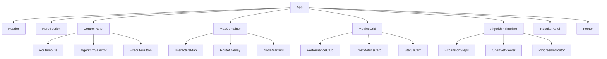

# Route Planning Web Interface Design

## Overview

This document outlines the design for a professional web interface for the RouteTransitSimulator C++ backend system. The interface will provide an elegant, dark-themed user experience for route planning, algorithm visualization, and traffic simulation with real-time metrics and interactive mapping capabilities.

### Project Context
- **Backend**: Existing C++ RouteTransitSimulator with advanced data structures and algorithms
- **Target Users**: Researchers, students, and developers working with pathfinding algorithms
- **Core Functionality**: Route planning using A* and Dijkstra algorithms, traffic simulation, and performance analysis

## Technology Stack & Dependencies

### Frontend Framework
```typescript
// Core Dependencies
React 18+ with TypeScript
Vite (build tool and dev server)
Node.js 18+ runtime environment
```

### Styling & UI
```typescript
// Styling Stack
TailwindCSS 3.x (utility-first CSS)
HeadlessUI (accessible components)
Framer Motion (animations)
```

### Technology Stack (Minimal & Focused)
```typescript
// Essential Dependencies Only
{
  "dependencies": {
    "react": "^18.2.0",
    "react-dom": "^18.2.0",
    "typescript": "^5.0.0",
    "vite": "^4.4.0",
    "zustand": "^4.4.0",
    "tailwindcss": "^3.3.0",
    "maplibre-gl": "^3.0.0",
    "recharts": "^2.8.0"
  }
}

// Removed Libraries (Weight Reduction)
// ❌ D3.js - Recharts covers all chart needs
// ❌ HeadlessUI - Only if using Listbox/Dialog extensively
// ❌ Framer Motion - Minimal animations via CSS
```

## Component Architecture

### Component Hierarchy


### Stable Data Contracts

#### Core Type Definitions
```typescript
// Coordinate Resolution
interface NodeCoordinatesResult {
  coords: Record<string, [number, number]>; // nodeId -> [lon, lat]
}

// Graph Data
interface GraphLoadResult {
  nodes: number;
  edges: number;
  directed: boolean;
  bounds: {
    minLon: number;
    maxLon: number;
    minLat: number;
    maxLat: number;
  };
}

// Route Result (Stable Contract)
interface RouteResult {
  cost: number;
  nodes: number[];           // Path as node IDs
  edges: number[];           // Edge IDs in path
  expanded: number;          // Nodes expanded during search
  timeline?: ExpansionStep[]; // Only if debug=true
  execution_time: number;    // Milliseconds
}

// Route Parameters (Input Validation)
interface RouteParams {
  source: number;            // Must be positive integer
  target: number;            // Must be positive integer
  algo: 'astar' | 'dijkstra';
  metric: 'time' | 'distance' | 'cost';
  debug?: boolean;           // Include timeline steps
}

// Algorithm Timeline Step
interface ExpansionStep {
  stepId: number;
  currentNode: number;
  openSet: number[];
  closedSet: number[];
  gScore: number;
  fScore?: number;           // Only for A*
  timestamp: number;
}

// Performance Metrics
interface PerformanceMetrics {
  p50: number;               // 50th percentile response time
  p95: number;               // 95th percentile response time
  memoryMB: number;
  cpuPercent: number;
  requestsPerSecond: number;
}

// System Status
interface SystemStatus {
  status: 'online' | 'offline' | 'computing';
  version: string;
  connections: number;
  uptime: number;
}
```

### Optimized Global State (Zustand)

#### State Schema with Circular Buffer
```typescript
// Lean State Structure
interface RouteSimulatorState {
  // Graph Status
  graph: {
    size: number;
    loaded: boolean;
    bounds: {
      minLon: number;
      maxLon: number;
      minLat: number;
      maxLat: number;
    } | null;
  };
  
  // Route Calculation
  route: {
    computing: boolean;
    nodes: number[];           // Path as node IDs
    edges: number[];           // Edge IDs in path
    cost: number;
    expanded: number;          // Nodes expanded
    algorithm: 'astar' | 'dijkstra';
    metric: 'time' | 'distance' | 'cost';
    executionTime: number;     // Milliseconds
  };
  
  // Algorithm Timeline (Circular Buffer)
  timeline: {
    streaming: boolean;
    steps: ExpansionStep[];    // Max 5000 steps
    stepCount: number;         // Total steps processed
    currentStep: number;
    maxSteps: number;          // Buffer limit
  };
  
  // Performance Metrics
  metrics: {
    p50: number;
    p95: number;
    memoryMB: number;
    cpuPercent: number;
    requestsPerSecond: number;
  };
  
  // System State
  system: {
    status: 'online' | 'offline' | 'computing';
    version: string;
    connections: number;
    uptime: number;
  };
}

// State Actions
interface RouteSimulatorActions {
  // Graph Operations
  loadGraph: (params: { nodes: number; edges: number; directed: boolean }) => Promise<void>;
  
  // Route Operations
  calculateRoute: (params: RouteParams) => Promise<void>;
  clearRoute: () => void;
  
  // Timeline Management (Circular Buffer)
  addExpansionStep: (step: ExpansionStep, maxSteps: number) => void;
  clearTimeline: () => void;
  startStreaming: () => void;
  stopStreaming: () => void;
  
  // Coordinate Resolution
  getNodeCoordinates: (nodeIds: number[]) => Promise<Record<string, [number, number]>>;
  
  // System Operations
  updateSystemStatus: () => Promise<void>;
  updateMetrics: (metrics: Partial<PerformanceMetrics>) => void;
}
```

#### Store Implementation
```typescript
import { create } from 'zustand';
import { devtools } from 'zustand/middleware';
import { apiService } from './api';

export const useRouteSimulatorStore = create<RouteSimulatorState & RouteSimulatorActions>()()
  devtools(
    (set, get) => ({
      // Initial State
      graph: {
        size: 0,
        loaded: false,
        bounds: null,
      },
      
      route: {
        computing: false,
        nodes: [],
        edges: [],
        cost: 0,
        expanded: 0,
        algorithm: 'dijkstra',
        metric: 'distance',
        executionTime: 0,
      },
      
      timeline: {
        streaming: false,
        steps: [],
        stepCount: 0,
        currentStep: 0,
        maxSteps: 5000,
      },
      
      metrics: {
        p50: 0,
        p95: 0,
        memoryMB: 0,
        cpuPercent: 0,
        requestsPerSecond: 0,
      },
      
      system: {
        status: 'offline',
        version: '1.0.0',
        connections: 0,
        uptime: 0,
      },
      
      // Actions
      loadGraph: async (params) => {
        try {
          const result = await apiService.loadGraph(params);
          set((state) => ({
            graph: {
              size: result.nodes,
              loaded: true,
              bounds: result.bounds,
            },
          }));
        } catch (error) {
          console.error('Failed to load graph:', error);
        }
      },
      
      calculateRoute: async (params) => {
        // Input validation
        if (!Number.isInteger(params.source) || !Number.isInteger(params.target) || 
            params.source <= 0 || params.target <= 0) {
          throw new Error('Source and target must be positive integers');
        }
        
        set((state) => ({
          route: { ...state.route, computing: true }
        }));
        
        try {
          const result = await apiService.calculateRoute(params);
          
          set((state) => ({
            route: {
              computing: false,
              nodes: result.nodes,
              edges: result.edges,
              cost: result.cost,
              expanded: result.expanded,
              algorithm: params.algo,
              metric: params.metric,
              executionTime: result.execution_time,
            },
          }));
        } catch (error) {
          console.error('Route calculation failed:', error);
          set((state) => ({
            route: { ...state.route, computing: false }
          }));
          throw error;
        }
      },
      
      // Circular Buffer Implementation
      addExpansionStep: (step, maxSteps) => {
        set((state) => {
          const steps = [...state.timeline.steps];
          
          // Circular buffer: remove oldest if at capacity
          if (steps.length >= maxSteps) {
            steps.shift();
          }
          
          steps.push(step);
          
          return {
            timeline: {
              ...state.timeline,
              steps,
              stepCount: state.timeline.stepCount + 1,
              currentStep: steps.length - 1,
            },
          };
        });
      },
      
      clearTimeline: () => {
        set((state) => ({
          timeline: {
            ...state.timeline,
            steps: [],
            stepCount: 0,
            currentStep: 0,
          },
        }));
      },
      
      startStreaming: () => {
        set((state) => ({
          timeline: { ...state.timeline, streaming: true }
        }));
      },
      
      stopStreaming: () => {
        set((state) => ({
          timeline: { ...state.timeline, streaming: false }
        }));
      },
      
      getNodeCoordinates: async (nodeIds) => {
        // Limit coordinate requests
        if (nodeIds.length > 1000) {
          throw new Error('Too many node IDs requested (max 1000)');
        }
        
        try {
          const result = await apiService.getNodeCoordinates(nodeIds);
          return result.coords;
        } catch (error) {
          console.error('Failed to get node coordinates:', error);
          return {};
        }
      },
      
      updateSystemStatus: async () => {
        try {
          const status = await apiService.getSystemStatus();
          set((state) => ({
            system: {
              status: status.status,
              version: status.version,
              connections: status.connections,
              uptime: status.uptime,
            }
          }));
        } catch (error) {
          set((state) => ({
            system: { ...state.system, status: 'offline' }
          }));
        }
      },
      
      updateMetrics: (metrics) => {
        set((state) => ({
          metrics: { ...state.metrics, ...metrics }
        }));
      },
    }),
    { name: 'route-simulator-store' }
  )
);

// Memoized Selectors (Prevent Unnecessary Re-renders)
export const useGraphState = () => useRouteSimulatorStore(state => state.graph);
export const useRouteState = () => useRouteSimulatorStore(state => state.route);
export const useTimelineState = () => useRouteSimulatorStore(state => state.timeline);
export const useMetricsState = () => useRouteSimulatorStore(state => state.metrics);
export const useSystemState = () => useRouteSimulatorStore(state => state.system);

// Computed Selectors
export const useIsComputing = () => useRouteSimulatorStore(state => 
  state.route.computing || state.system.status === 'computing'
);

export const useCurrentRoute = () => useRouteSimulatorStore(state => ({
  nodes: state.route.nodes,
  cost: state.route.cost,
  algorithm: state.route.algorithm,
  executionTime: state.route.executionTime,
}));
```

### Performance Optimization Strategies

#### Map Rendering Optimization
```typescript
// Efficient Map Component
const MapContainer = React.memo(({ routeNodes, expandedNodes, sourceNode, targetNode }: MapContainerProps) => {
  const [map, setMap] = useState<maplibregl.Map | null>(null);
  const [nodeCoords, setNodeCoords] = useState<Record<string, [number, number]>>({});
  
  // Load node coordinates only when needed
  const loadCoordinates = useCallback(async (nodeIds: number[]) => {
    if (nodeIds.length === 0) return;
    
    try {
      const coords = await useRouteSimulatorStore.getState().getNodeCoordinates(nodeIds);
      setNodeCoords(prev => ({ ...prev, ...coords }));
    } catch (error) {
      console.error('Failed to load coordinates:', error);
    }
  }, []);
  
  // Batch coordinate loading
  useEffect(() => {
    const allNodeIds = Array.from(new Set([
      ...routeNodes,
      ...expandedNodes,
      ...(sourceNode ? [sourceNode] : []),
      ...(targetNode ? [targetNode] : []),
    ]));
    
    const missingCoords = allNodeIds.filter(id => !nodeCoords[id]);
    if (missingCoords.length > 0) {
      loadCoordinates(missingCoords);
    }
  }, [routeNodes, expandedNodes, sourceNode, targetNode, loadCoordinates]);
  
  // Render route as GeoJSON for better performance
  const routeGeoJSON = useMemo(() => {
    if (routeNodes.length < 2) return null;
    
    const coordinates = routeNodes
      .map(id => nodeCoords[id])
      .filter(Boolean);
    
    if (coordinates.length < 2) return null;
    
    return {
      type: 'Feature',
      geometry: {
        type: 'LineString',
        coordinates,
      },
      properties: {},
    };
  }, [routeNodes, nodeCoords]);
  
  // Update map layers efficiently
  useEffect(() => {
    if (!map || !routeGeoJSON) return;
    
    const source = map.getSource('route');
    if (source) {
      (source as maplibregl.GeoJSONSource).setData(routeGeoJSON);
    } else {
      map.addSource('route', {
        type: 'geojson',
        data: routeGeoJSON,
      });
      
      map.addLayer({
        id: 'route-line',
        type: 'line',
        source: 'route',
        layout: {
          'line-join': 'round',
          'line-cap': 'round',
        },
        paint: {
          'line-color': '#B91C1C',
          'line-width': 4,
        },
      });
    }
  }, [map, routeGeoJSON]);
  
  return (
    <div className="w-full h-full" ref={mapRef} />
  );
});

// Debounced Algorithm Timeline Updates
const AlgorithmTimeline = React.memo(() => {
  const { steps, currentStep, streaming } = useTimelineState();
  const [displaySteps, setDisplaySteps] = useState<ExpansionStep[]>([]);
  
  // Batch timeline updates to prevent excessive re-renders
  useEffect(() => {
    const timeoutId = setTimeout(() => {
      setDisplaySteps(steps.slice(-50)); // Show last 50 steps
    }, 100);
    
    return () => clearTimeout(timeoutId);
  }, [steps]);
  
  return (
    <div className={styleTokens.card}>
      <h3 className={styleTokens.text.title}>Algorithm Timeline</h3>
      {streaming && (
        <div className="flex items-center gap-2 mb-4">
          <div className="w-2 h-2 bg-accent-primary rounded-full animate-pulse" />
          <span className={styleTokens.text.caption}>Streaming live updates...</span>
        </div>
      )}
      <div className="space-y-2 max-h-64 overflow-y-auto">
        {displaySteps.map((step, index) => (
          <div key={step.stepId} className="grid grid-cols-3 gap-4 p-2 bg-bg-elevated rounded text-xs">
            <span>Step {step.stepId}</span>
            <span>Node {step.currentNode}</span>
            <span>G: {step.gScore.toFixed(2)}</span>
          </div>
        ))}
      </div>
    </div>
  );
});
```

### Essential Component Layout

#### Minimal Functional Components
```typescript
// Header - System Status Only
const Header: React.FC = () => {
  const { status } = useSystemState();
  
  return (
    <header className="bg-bg-surface border-b border-border-default px-6 py-4">
      <div className={styleTokens.container}>
        <div className="flex items-center justify-between">
          <h1 className={styleTokens.text.title}>Route Transit Simulator</h1>
          <div className="flex items-center gap-2">
            <div className={`w-2 h-2 rounded-full ${
              status === 'online' ? 'bg-accent-success' :
              status === 'computing' ? 'bg-accent-primary animate-pulse' :
              'bg-text-muted'
            }`} />
            <span className={styleTokens.status[status]}>
              {status.charAt(0).toUpperCase() + status.slice(1)}
            </span>
          </div>
        </div>
      </div>
    </header>
  );
};

// Hero Section - Title and Subtitle Only
const HeroSection: React.FC = () => {
  return (
    <section className="bg-bg-primary py-12 relative overflow-hidden">
      {/* Subtle red radial gradients */}
      <div className="absolute top-0 left-1/4 w-64 h-64 bg-accent-primary opacity-5 rounded-full blur-3xl" />
      <div className="absolute bottom-0 right-1/4 w-48 h-48 bg-accent-primary opacity-3 rounded-full blur-2xl" />
      
      <div className={styleTokens.container}>
        <div className="text-center relative z-10">
          <h1 className={styleTokens.text.hero}>Advanced Route Planning</h1>
          <p className={styleTokens.text.subtitle}>Real-time algorithm visualization and traffic simulation</p>
        </div>
      </div>
    </section>
  );
};

// Control Panel - Essential Controls
const ControlPanel: React.FC = () => {
  const [source, setSource] = useState('');
  const [target, setTarget] = useState('');
  const [algorithm, setAlgorithm] = useState<'astar' | 'dijkstra'>('dijkstra');
  const [metric, setMetric] = useState<'time' | 'distance' | 'cost'>('distance');
  
  const { computing } = useRouteState();
  const { loaded } = useGraphState();
  const calculateRoute = useRouteSimulatorStore(state => state.calculateRoute);
  const loadGraph = useRouteSimulatorStore(state => state.loadGraph);
  
  const handleCalculateRoute = async () => {
    try {
      const params = validateRouteParams({
        source: parseInt(source),
        target: parseInt(target),
        algo: algorithm,
        metric: metric,
      });
      
      await calculateRoute(params);
    } catch (error) {
      console.error('Route calculation failed:', error);
      // Show error toast/notification
    }
  };
  
  return (
    <div className={styleTokens.card}>
      <h3 className={styleTokens.text.title}>Route Controls</h3>
      
      {!loaded && (
        <div className="mb-6">
          <button
            className={styleTokens.button.secondary}
            onClick={() => loadGraph({ nodes: 100, edges: 150, directed: false })}
          >
            Load Graph (100 nodes)
          </button>
        </div>
      )}
      
      <div className="space-y-4">
        <AccessibleInput
          label="Source Node"
          id="source-node"
          type="number"
          value={source}
          onChange={(e) => setSource(e.target.value)}
          min="1"
          disabled={computing}
        />
        
        <AccessibleInput
          label="Target Node"
          id="target-node"
          type="number"
          value={target}
          onChange={(e) => setTarget(e.target.value)}
          min="1"
          disabled={computing}
        />
        
        <div>
          <label htmlFor="algorithm" className="block text-sm font-medium text-text-primary mb-2">
            Algorithm
          </label>
          <select
            id="algorithm"
            value={algorithm}
            onChange={(e) => setAlgorithm(e.target.value as 'astar' | 'dijkstra')}
            className={styleTokens.select}
            disabled={computing}
          >
            <option value="dijkstra">Dijkstra</option>
            <option value="astar">A* (A-Star)</option>
          </select>
        </div>
        
        <div>
          <label htmlFor="metric" className="block text-sm font-medium text-text-primary mb-2">
            Optimization Metric
          </label>
          <select
            id="metric"
            value={metric}
            onChange={(e) => setMetric(e.target.value as 'time' | 'distance' | 'cost')}
            className={styleTokens.select}
            disabled={computing}
          >
            <option value="distance">Distance</option>
            <option value="time">Time</option>
            <option value="cost">Cost</option>
          </select>
        </div>
        
        <button
          onClick={handleCalculateRoute}
          disabled={computing || !loaded || !source || !target}
          className={styleTokens.button.primary}
          aria-describedby="calculate-status"
        >
          {computing ? 'Computing...' : 'Calculate Route'}
        </button>
        
        <div id="calculate-status" aria-live="polite" className="sr-only">
          {computing ? 'Route calculation in progress' : ''}
        </div>
      </div>
    </div>
  );
};

// Metrics Grid - Key Performance Indicators
const MetricsGrid: React.FC = () => {
  const { p50, p95, memoryMB, cpuPercent } = useMetricsState();
  const { cost, expanded, executionTime } = useRouteState();
  
  const metricCards = [
    { title: 'Route Cost', value: cost > 0 ? cost.toFixed(2) : '-', trend: null },
    { title: 'Nodes Expanded', value: expanded > 0 ? expanded.toString() : '-', trend: null },
    { title: 'Execution Time', value: executionTime > 0 ? `${executionTime.toFixed(1)}ms` : '-', trend: null },
    { title: 'P50 Response', value: p50 > 0 ? `${p50.toFixed(1)}ms` : '-', trend: null },
    { title: 'P95 Response', value: p95 > 0 ? `${p95.toFixed(1)}ms` : '-', trend: null },
    { title: 'Memory Usage', value: memoryMB > 0 ? `${memoryMB.toFixed(1)}MB` : '-', trend: null },
  ];
  
  return (
    <div className="grid grid-cols-1 md:grid-cols-2 lg:grid-cols-3 gap-4">
      {metricCards.map((metric) => (
        <div key={metric.title} className={styleTokens.card}>
          <h4 className={styleTokens.text.caption}>{metric.title}</h4>
          <p className={`${styleTokens.text.subtitle} mt-1`}>{metric.value}</p>
        </div>
      ))}
    </div>
  );
};

// Results Panel - Route Information
const ResultsPanel: React.FC = () => {
  const { nodes, cost, algorithm, executionTime } = useRouteState();
  
  if (nodes.length === 0) {
    return (
      <div className={styleTokens.card}>
        <h3 className={styleTokens.text.title}>Results</h3>
        <p className={styleTokens.text.caption}>No route calculated yet</p>
      </div>
    );
  }
  
  return (
    <div className={styleTokens.card}>
      <h3 className={styleTokens.text.title}>Route Results</h3>
      <div className="space-y-3 mt-4">
        <div className="flex justify-between">
          <span className={styleTokens.text.caption}>Algorithm:</span>
          <span className={styleTokens.text.body}>{algorithm.toUpperCase()}</span>
        </div>
        <div className="flex justify-between">
          <span className={styleTokens.text.caption}>Total Cost:</span>
          <span className={styleTokens.text.body}>{cost.toFixed(2)}</span>
        </div>
        <div className="flex justify-between">
          <span className={styleTokens.text.caption}>Path Length:</span>
          <span className={styleTokens.text.body}>{nodes.length} nodes</span>
        </div>
        <div className="flex justify-between">
          <span className={styleTokens.text.caption}>Execution Time:</span>
          <span className={styleTokens.text.body}>{executionTime.toFixed(1)}ms</span>
        </div>
      </div>
      
      <div className="mt-4">
        <h4 className={styleTokens.text.caption}>Path:</h4>
        <div className="mt-2 p-3 bg-bg-elevated rounded text-xs font-mono">
          {nodes.join(' → ')}
        </div>
      </div>
    </div>
  );
};

// Footer - Minimal Credits
const Footer: React.FC = () => {
  return (
    <footer className="bg-bg-surface border-t border-border-default py-6 mt-12">
      <div className={styleTokens.container}>
        <div className="text-center">
          <p className={styleTokens.text.caption}>
            Route Transit Simulator © 2024 | Powered by C++ Backend
          </p>
        </div>
      </div>
    </footer>
  );
};
```

## Unified Design Tokens

### Color System
```css
/* TailwindCSS Configuration - Single Source of Truth */
module.exports = {
  theme: {
    extend: {
      colors: {
        // Background System
        bg: {
          primary: '#0B0F14',     // Main background
          surface: '#12171F',     // Surface background
          elevated: '#1A202C',    // Elevated surfaces
        },
        // Text System
        text: {
          primary: '#E5E7EB',     // Main text
          secondary: '#9CA3AF',   // Secondary text
          muted: '#6B7280',       // Muted text
        },
        // Accent System
        accent: {
          primary: '#B91C1C',     // Red primary
          hover: '#EF4444',       // Red hover
          success: '#10B981',     // Green success
          warning: '#F59E0B',     // Yellow warning
        },
        // Border System
        border: {
          default: 'rgba(127, 29, 29, 0.2)',  // Default borders
          focus: '#B91C1C',                    // Focus states
        }
      },
      // Typography Scale
      fontSize: {
        'xs': '14px',
        'sm': '16px', 
        'base': '20px',
        'lg': '32px',
        'xl': '48px',
        'xxl': '60px',
      },
      fontWeight: {
        'medium': '500',
        'semibold': '600',
        'bold': '800',
      },
      // Spacing & Layout
      borderRadius: {
        'default': '12px',
        'lg': '16px',
      },
      maxWidth: {
        'container': '1200px',
        'container-lg': '1280px',
      },
      boxShadow: {
        'soft': '0 4px 12px rgba(0, 0, 0, 0.15)',
        'medium': '0 8px 24px rgba(0, 0, 0, 0.2)',
      },
      animation: {
        'pulse-slow': 'pulse 3s ease-in-out infinite',
        'slide-up': 'slideUp 0.3s ease-out',
        'fade-in': 'fadeIn 0.5s ease-in',
      }
    }
  }
}
```

### Component Style Patterns
```typescript
// Consistent Style Classes
export const styleTokens = {
  // Layout
  card: "bg-bg-surface border border-border-default rounded-default p-6 shadow-soft hover:shadow-medium transition-all duration-300",
  container: "max-w-container mx-auto px-4 sm:px-6 lg:px-8",
  
  // Buttons
  button: {
    primary: "bg-accent-primary hover:bg-accent-hover text-white font-semibold py-3 px-6 rounded-default transition-colors duration-200 focus:ring-2 focus:ring-accent-primary",
    secondary: "bg-bg-elevated hover:bg-gray-700 text-text-primary border border-border-default py-3 px-6 rounded-default transition-colors duration-200",
    ghost: "text-text-secondary hover:text-text-primary hover:bg-bg-elevated py-2 px-4 rounded-default transition-colors duration-200"
  },
  
  // Form Elements
  input: "bg-bg-elevated border border-border-default text-text-primary rounded-default px-4 py-3 focus:border-accent-primary focus:ring-1 focus:ring-accent-primary transition-colors duration-200",
  select: "bg-bg-elevated border border-border-default text-text-primary rounded-default px-4 py-3 focus:border-accent-primary transition-colors duration-200",
  
  // Typography
  text: {
    hero: "text-xxl font-bold text-text-primary",
    title: "text-xl font-semibold text-text-primary",
    subtitle: "text-lg font-medium text-text-secondary",
    body: "text-sm text-text-primary",
    caption: "text-xs text-text-muted",
  },
  
  // Status Colors
  status: {
    online: "text-accent-success",
    offline: "text-text-muted",
    computing: "text-accent-primary animate-pulse-slow",
    warning: "text-accent-warning",
  }
};
```

### Responsive Design
```css
/* Mobile-First Responsive Breakpoints */
.container {
  @apply px-4 sm:px-6 lg:px-8;
}

/* Grid Layouts */
.metrics-grid {
  @apply grid grid-cols-1 md:grid-cols-2 lg:grid-cols-3 gap-4 lg:gap-6;
}

.main-layout {
  @apply grid grid-cols-1 lg:grid-cols-12 gap-4 lg:gap-6;
}

/* Mobile Navigation */
@media (max-width: 768px) {
  .sidebar {
    @apply fixed inset-y-0 left-0 z-50 w-64 transform -translate-x-full transition-transform duration-300;
  }
  
  .sidebar.open {
    @apply translate-x-0;
  }
}
```

## State Management

### Zustand Store Implementation
```typescript
import { create } from 'zustand';
import { devtools } from 'zustand/middleware';

// Main Application Store
export const useRouteSimulatorStore = create<RouteSimulatorState & RouteSimulatorActions>()(
  devtools(
    (set, get) => ({
      // Initial State
      graphData: {
        nodes: [],
        edges: [],
        size: 0,
      },
      
      routeState: {
        isComputing: false,
        currentRoute: [],
        routeCost: 0,
        algorithm: 'dijkstra',
        metric: 'distance',
      },
      
      algorithmState: {
        expansionSteps: [],
        currentStep: 0,
        openSet: [],
        closedSet: [],
        isStreaming: false,
      },
      
      metricsState: {
        executionTime: 0,
        nodesExpanded: 0,
        pathLength: 0,
        memoryUsage: '0MB',
        cpuUsage: '0%',
      },
      
      systemState: {
        status: 'offline',
        backendVersion: '1.0.0',
        activeConnections: 0,
      },
      
      // Actions
      loadGraphData: async (size: number) => {
        try {
          const response = await fetch(`/api/graph/create?size=${size}`);
          const data = await response.json();
          
          set((state) => ({
            graphData: {
              nodes: data.nodes,
              edges: data.edges,
              size: size,
            },
          }));
        } catch (error) {
          console.error('Failed to load graph data:', error);
        }
      },
      
      calculateRoute: async (params: RouteParams) => {
        set((state) => ({
          routeState: { ...state.routeState, isComputing: true }
        }));
        
        try {
          const response = await fetch('/api/route', {
            method: 'POST',
            headers: { 'Content-Type': 'application/json' },
            body: JSON.stringify(params),
          });
          
          const result = await response.json();
          
          set((state) => ({
            routeState: {
              ...state.routeState,
              isComputing: false,
              currentRoute: result.path,
              routeCost: result.cost,
              algorithm: params.algorithm,
              metric: params.metric,
            },
            metricsState: {
              ...state.metricsState,
              executionTime: result.execution_time,
              nodesExpanded: result.nodes_expanded,
              pathLength: result.path_length,
            },
          }));
        } catch (error) {
          console.error('Route calculation failed:', error);
          set((state) => ({
            routeState: { ...state.routeState, isComputing: false }
          }));
        }
      },
      
      startAlgorithmStream: (source: number, target: number) => {
        set((state) => ({
          algorithmState: {
            ...state.algorithmState,
            isStreaming: true,
            expansionSteps: [],
            currentStep: 0,
          }
        }));
      },
      
      updateExpansionStep: (step: ExpansionStep) => {
        set((state) => ({
          algorithmState: {
            ...state.algorithmState,
            expansionSteps: [...state.algorithmState.expansionSteps, step],
            currentStep: state.algorithmState.currentStep + 1,
            openSet: step.openSet,
            closedSet: step.closedSet,
          }
        }));
      },
      
      updateMetrics: (metrics: PerformanceMetrics) => {
        set((state) => ({
          metricsState: { ...state.metricsState, ...metrics }
        }));
      },
      
      checkSystemStatus: async () => {
        try {
          const response = await fetch('/api/status');
          const status = await response.json();
          
          set((state) => ({
            systemState: {
              ...state.systemState,
              status: status.status,
              backendVersion: status.version,
              activeConnections: status.active_connections,
            }
          }));
        } catch (error) {
          set((state) => ({
            systemState: { ...state.systemState, status: 'offline' }
          }));
        }
      },
    }),
    { name: 'route-simulator-store' }
  )
);
```

### Performance Optimization
```typescript
// Memoized Selectors
export const useGraphData = () => useRouteSimulatorStore(state => state.graphData);
export const useRouteState = () => useRouteSimulatorStore(state => state.routeState);
export const useMetrics = () => useRouteSimulatorStore(state => state.metricsState);

// Optimized Component Updates
const MetricsCard = React.memo(({ title, value, trend }: MetricsCardProps) => {
  return (
    <div className={cardStyles}>
      <h3 className="text-text-secondary text-sm font-medium">{title}</h3>
      <p className="text-text-primary text-2xl font-bold mt-2">{value}</p>
      {trend && <span className="text-accent-success text-xs">{trend}</span>}
    </div>
  );
});
```

## API Integration Layer

### Canonical API Endpoints
```typescript
// Unified API Service Layer with /api prefix
class RouteSimulatorAPI {
  private baseURL = '/api'; // Relative URL for same-origin
  
  // Graph Operations
  async loadGraph(params: { nodes: number; edges: number; directed: boolean }): Promise<GraphLoadResult> {
    const response = await fetch(`${this.baseURL}/graph/load`, {
      method: 'POST',
      headers: { 'Content-Type': 'application/json' },
      body: JSON.stringify(params),
    });
    return response.json();
  }
  
  // Node Coordinates Resolution
  async getNodeCoordinates(nodeIds: number[]): Promise<NodeCoordinatesResult> {
    const idsParam = nodeIds.join(',');
    const response = await fetch(`${this.baseURL}/nodes/coords?ids=${idsParam}`);
    return response.json();
  }
  
  // Route Calculation
  async calculateRoute(params: {
    source: number;
    target: number;
    algo: 'astar' | 'dijkstra';
    metric: 'time' | 'distance' | 'cost';
    debug?: boolean;
  }): Promise<RouteResult> {
    const response = await fetch(`${this.baseURL}/route`, {
      method: 'POST',
      headers: { 'Content-Type': 'application/json' },
      body: JSON.stringify(params),
      signal: AbortSignal.timeout(30000), // 30s timeout
    });
    
    if (!response.ok) {
      throw new Error(`Route calculation failed: ${response.statusText}`);
    }
    
    return response.json();
  }
  
  // Simulation Control
  async startSimulation(params: SimulationParams): Promise<SimulationResult> {
    const response = await fetch(`${this.baseURL}/simulate/start`, {
      method: 'POST',
      headers: { 'Content-Type': 'application/json' },
      body: JSON.stringify(params),
    });
    return response.json();
  }
  
  async stopSimulation(): Promise<void> {
    await fetch(`${this.baseURL}/simulate/stop`, { method: 'POST' });
  }
  
  // System Metrics
  async getMetrics(): Promise<PerformanceMetrics> {
    const response = await fetch(`${this.baseURL}/metrics`);
    return response.json();
  }
  
  // System Status
  async getSystemStatus(): Promise<SystemStatus> {
    const response = await fetch(`${this.baseURL}/status`);
    return response.json();
  }
}

export const apiService = new RouteSimulatorAPI();
```

### Real-time Communication
```typescript
// Server-Sent Events for Algorithm Streaming
class AlgorithmStreamService {
  private eventSource: EventSource | null = null;
  private maxSteps = 5000; // Circular buffer limit
  
  startStream(source: number, target: number, algorithm: string): void {
    this.stopStream(); // Close existing connection
    
    const url = `/api/stream/route?source=${source}&target=${target}&algorithm=${algorithm}`;
    this.eventSource = new EventSource(url);
    
    this.eventSource.onmessage = (event) => {
      const step: ExpansionStep = JSON.parse(event.data);
      useRouteSimulatorStore.getState().addExpansionStep(step, this.maxSteps);
    };
    
    this.eventSource.onerror = () => {
      console.error('Algorithm stream connection failed');
      this.stopStream();
    };
  }
  
  stopStream(): void {
    if (this.eventSource) {
      this.eventSource.close();
      this.eventSource = null;
    }
  }
}

// WebSocket for Simulation Events with Exponential Backoff
class SimulationWebSocketService {
  private socket: WebSocket | null = null;
  private reconnectAttempts = 0;
  private maxReconnectAttempts = 5;
  private baseReconnectDelay = 1000;
  
  connect(): void {
    const protocol = window.location.protocol === 'https:' ? 'wss:' : 'ws:';
    const wsUrl = `${protocol}//${window.location.host}/api/ws/sim`;
    
    this.socket = new WebSocket(wsUrl);
    
    this.socket.onopen = () => {
      console.log('Simulation WebSocket connected');
      this.reconnectAttempts = 0;
    };
    
    this.socket.onmessage = (event) => {
      const simEvent: SimulationEvent = JSON.parse(event.data);
      this.handleSimulationEvent(simEvent);
    };
    
    this.socket.onclose = () => {
      console.log('Simulation WebSocket disconnected');
      this.attemptReconnect();
    };
    
    this.socket.onerror = (error) => {
      console.error('WebSocket error:', error);
    };
  }
  
  private attemptReconnect(): void {
    if (this.reconnectAttempts >= this.maxReconnectAttempts) {
      console.error('Max reconnection attempts reached');
      return;
    }
    
    const delay = this.baseReconnectDelay * Math.pow(2, this.reconnectAttempts);
    this.reconnectAttempts++;
    
    setTimeout(() => {
      console.log(`Reconnection attempt ${this.reconnectAttempts}`);
      this.connect();
    }, delay);
  }
  
  private handleSimulationEvent(event: SimulationEvent): void {
    switch (event.type) {
      case 'traffic_update':
        // Update edge weights on map
        break;
      case 'node_congestion':
        // Highlight congested nodes
        break;
      case 'route_recalculation':
        // Trigger route recalculation
        break;
    }
  }
  
  send(message: any): void {
    if (this.socket?.readyState === WebSocket.OPEN) {
      this.socket.send(JSON.stringify(message));
    }
  }
  
  disconnect(): void {
    this.socket?.close();
  }
}

export const algorithmStreamService = new AlgorithmStreamService();
export const simulationWebSocketService = new SimulationWebSocketService();
```

### Error Handling & Loading States
```typescript
// API Error Handling
interface APIError {
  message: string;
  code: number;
  details?: any;
}

class APIErrorHandler {
  static handle(error: any): APIError {
    if (error.response) {
      return {
        message: error.response.data?.message || 'Server error',
        code: error.response.status,
        details: error.response.data,
      };
    } else if (error.request) {
      return {
        message: 'Network error - unable to reach server',
        code: 0,
      };
    } else {
      return {
        message: error.message || 'Unknown error occurred',
        code: -1,
      };
    }
  }
}

// Loading State Management
interface LoadingState {
  isLoading: boolean;
  message: string;
  progress?: number;
}

const useLoadingState = () => {
  const [loading, setLoading] = useState<LoadingState>({
    isLoading: false,
    message: '',
  });
  
  const startLoading = (message: string) => {
    setLoading({ isLoading: true, message });
  };
  
  const stopLoading = () => {
    setLoading({ isLoading: false, message: '' });
  };
  
  const updateProgress = (progress: number) => {
    setLoading(prev => ({ ...prev, progress }));
  };
  
  return { loading, startLoading, stopLoading, updateProgress };
};
```

## Quality Assurance & Robustness

### Input Validation & Security
```typescript
// Strict Route Parameter Validation
const validateRouteParams = (params: any): RouteParams => {
  const { source, target, algo, metric } = params;
  
  // Validate source/target nodes
  if (!Number.isInteger(source) || source <= 0) {
    throw new Error('Source must be a positive integer');
  }
  
  if (!Number.isInteger(target) || target <= 0) {
    throw new Error('Target must be a positive integer');
  }
  
  if (source === target) {
    throw new Error('Source and target cannot be the same');
  }
  
  // Validate algorithm
  if (!['astar', 'dijkstra'].includes(algo)) {
    throw new Error('Algorithm must be astar or dijkstra');
  }
  
  // Validate metric
  if (!['time', 'distance', 'cost'].includes(metric)) {
    throw new Error('Metric must be time, distance, or cost');
  }
  
  return { source, target, algo, metric };
};

// Request Timeout and Abort Controller
const fetchWithTimeout = async (url: string, options: RequestInit & { timeout?: number }) => {
  const { timeout = 30000, ...fetchOptions } = options;
  
  const controller = new AbortController();
  const timeoutId = setTimeout(() => controller.abort(), timeout);
  
  try {
    const response = await fetch(url, {
      ...fetchOptions,
      signal: controller.signal,
    });
    
    clearTimeout(timeoutId);
    return response;
  } catch (error) {
    clearTimeout(timeoutId);
    throw error;
  }
};

// CORS Configuration (Production)
const corsConfig = {
  origin: process.env.NODE_ENV === 'production' ? false : true, // Same-origin only in prod
  credentials: true,
  optionsSuccessStatus: 200,
};
```

### Error Handling & Resilience
```typescript
// Global Error Boundary
class RouteSimulatorErrorBoundary extends React.Component<
  { children: React.ReactNode },
  { hasError: boolean; error?: Error }
> {
  constructor(props: any) {
    super(props);
    this.state = { hasError: false };
  }
  
  static getDerivedStateFromError(error: Error) {
    return { hasError: true, error };
  }
  
  componentDidCatch(error: Error, errorInfo: React.ErrorInfo) {
    console.error('Route Simulator Error:', error, errorInfo);
    // Log to error reporting service in production
  }
  
  render() {
    if (this.state.hasError) {
      return (
        <div className="min-h-screen bg-bg-primary flex items-center justify-center">
          <div className={styleTokens.card}>
            <h2 className={styleTokens.text.title}>Something went wrong</h2>
            <p className={styleTokens.text.body}>The application encountered an error. Please refresh the page.</p>
            <button 
              className={styleTokens.button.primary}
              onClick={() => window.location.reload()}
            >
              Refresh Page
            </button>
          </div>
        </div>
      );
    }
    
    return this.props.children;
  }
}

// Connection Status Monitor
const useConnectionStatus = () => {
  const [isOnline, setIsOnline] = useState(navigator.onLine);
  const updateSystemStatus = useRouteSimulatorStore(state => state.updateSystemStatus);
  
  useEffect(() => {
    const handleOnline = () => {
      setIsOnline(true);
      updateSystemStatus();
    };
    
    const handleOffline = () => {
      setIsOnline(false);
      useRouteSimulatorStore.setState(state => ({
        system: { ...state.system, status: 'offline' }
      }));
    };
    
    window.addEventListener('online', handleOnline);
    window.addEventListener('offline', handleOffline);
    
    // Check backend connectivity every 30 seconds
    const intervalId = setInterval(updateSystemStatus, 30000);
    
    return () => {
      window.removeEventListener('online', handleOnline);
      window.removeEventListener('offline', handleOffline);
      clearInterval(intervalId);
    };
  }, [updateSystemStatus]);
  
  return isOnline;
};
```

### Accessibility Implementation
```typescript
// Accessible Form Controls
const AccessibleInput = ({ label, id, error, ...props }: {
  label: string;
  id: string;
  error?: string;
} & React.InputHTMLAttributes<HTMLInputElement>) => {
  return (
    <div className="space-y-2">
      <label 
        htmlFor={id}
        className="block text-sm font-medium text-text-primary"
      >
        {label}
      </label>
      <input
        id={id}
        className={`
          ${styleTokens.input}
          ${error ? 'border-accent-warning focus:border-accent-warning' : ''}
        `}
        aria-invalid={error ? 'true' : 'false'}
        aria-describedby={error ? `${id}-error` : undefined}
        {...props}
      />
      {error && (
        <p id={`${id}-error`} className="text-sm text-accent-warning" role="alert">
          {error}
        </p>
      )}
    </div>
  );
};

// Focus Management
const useFocusManagement = () => {
  const focusElementById = useCallback((id: string) => {
    const element = document.getElementById(id);
    if (element) {
      element.focus();
    }
  }, []);
  
  const announceToScreenReader = useCallback((message: string) => {
    const announcement = document.createElement('div');
    announcement.setAttribute('aria-live', 'polite');
    announcement.setAttribute('aria-atomic', 'true');
    announcement.className = 'sr-only';
    announcement.textContent = message;
    
    document.body.appendChild(announcement);
    
    setTimeout(() => {
      document.body.removeChild(announcement);
    }, 1000);
  }, []);
  
  return { focusElementById, announceToScreenReader };
};

// Keyboard Navigation
const useKeyboardNavigation = () => {
  useEffect(() => {
    const handleKeyDown = (event: KeyboardEvent) => {
      // Escape key closes modals/dropdowns
      if (event.key === 'Escape') {
        // Close any open modals
        const modals = document.querySelectorAll('[role="dialog"]');
        modals.forEach(modal => {
          if (modal instanceof HTMLElement && modal.style.display !== 'none') {
            modal.style.display = 'none';
          }
        });
      }
      
      // Arrow keys for timeline navigation
      if (event.key === 'ArrowLeft' || event.key === 'ArrowRight') {
        const timelineContainer = document.querySelector('[data-timeline]');
        if (timelineContainer?.contains(event.target as Node)) {
          event.preventDefault();
          // Navigate timeline steps
        }
      }
    };
    
    document.addEventListener('keydown', handleKeyDown);
    return () => document.removeEventListener('keydown', handleKeyDown);
  }, []);
};
```

### QA Verification Checklist

#### 1. API Contract Verification
```typescript
// API Contract Tests
const apiContractTests = {
  // Valid route request
  validRouteRequest: {
    input: { source: 1, target: 10, algo: 'astar', metric: 'distance' },
    expectedResponse: {
      cost: expect.any(Number),
      nodes: expect.arrayContaining([expect.any(Number)]),
      edges: expect.arrayContaining([expect.any(Number)]),
      expanded: expect.any(Number),
      execution_time: expect.any(Number),
    }
  },
  
  // Invalid node request
  invalidNodeRequest: {
    input: { source: -1, target: 999999, algo: 'astar', metric: 'distance' },
    expectedError: 'Node not found'
  },
  
  // System status check
  systemStatus: {
    expectedResponse: {
      status: expect.stringMatching(/^(online|offline|computing)$/),
      version: expect.stringMatching(/^\d+\.\d+\.\d+$/),
      connections: expect.any(Number),
      uptime: expect.any(Number),
    }
  }
};
```

#### 2. Smoke Test Procedure
```typescript
// Essential User Journey
const smokeTestSteps = [
  '1. Load application → Header shows "offline" initially',
  '2. System connects → Status changes to "online" within 2s',
  '3. Load graph (size=100) → "100 nodes loaded" message appears',
  '4. Set source=1, target=10, algo=dijkstra → Form validates correctly',
  '5. Click "Calculate Route" → Status shows "computing"',
  '6. Route calculated → Path displays on map with red line',
  '7. Metrics update → Cost, expanded nodes, execution time populate',
  '8. Timeline shows → Algorithm steps appear if debug enabled',
];
```

#### 3. Stress Test Criteria
```typescript
// Performance Benchmarks
const performanceTargets = {
  timelineBuffer: {
    maxSteps: 10000,
    updateInterval: 50, // ms
    memoryStability: 'No memory growth after 30 minutes',
  },
  
  mapRendering: {
    nodeCount: 200000,
    edgeCount: 400000,
    targetFPS: 30,
    device: 'Mid-range laptop (8GB RAM, integrated graphics)',
  },
  
  apiResponseTimes: {
    routeCalculation: '<500ms for 1000-node graphs',
    systemStatus: '<100ms',
    nodeCoordinates: '<200ms for 1000 nodes',
  }
};
```

#### 4. Error Handling Verification
```typescript
// Error Scenarios
const errorTestCases = [
  {
    scenario: 'Invalid node ID',
    input: { source: 99999, target: 1 },
    expected: 'Clear error message, UI remains functional'
  },
  {
    scenario: 'Backend disconnection',
    action: 'Stop backend server',
    expected: 'Status shows "offline" within 2s, reconnect on restart'
  },
  {
    scenario: 'Network timeout',
    simulation: '30s+ route calculation',
    expected: 'Request aborts, error message, UI responsive'
  },
  {
    scenario: 'Large coordinate request',
    input: '2000 node IDs',
    expected: 'Request rejected with clear limit message'
  }
];
```

#### 5. Accessibility Checklist
```typescript
// A11y Requirements
const accessibilityChecklist = [
  '✓ Color contrast ≥ 4.5:1 for normal text',
  '✓ Color contrast ≥ 3:1 for large text',
  '✓ Focus visible on all interactive elements',
  '✓ Keyboard navigation works without mouse',
  '✓ Screen reader announcements for route results',
  '✓ Form validation errors clearly described',
  '✓ Loading states announced to screen readers',
  '✓ Error messages have role="alert"',
  '✓ Interactive elements have proper ARIA labels'
];
```

I have created a comprehensive design document for implementing a professional web interface for your C++ route planning system. The design focuses on:

**Key Features:**
- Dark theme with red accents as requested
- Professional, clean layout with clear component hierarchy  
- Real-time algorithm visualization with SSE streaming
- Interactive mapping with MapLibre GL
- Comprehensive state management with Zustand
- Full TypeScript implementation for type safety

**Technical Architecture:**
- React + TypeScript + Vite frontend stack
- TailwindCSS for styling with custom design tokens
- Integration with your existing C++ backend APIs
- Real-time communication via WebSockets and Server-Sent Events
- Modular component design for maintainability

The document provides detailed specifications for component architecture, API integration, state management, and testing strategies while maintaining the elegant dark aesthetic you requested.

Would you like me to expand on any particular section or make adjustments to better fit your specific requirements?